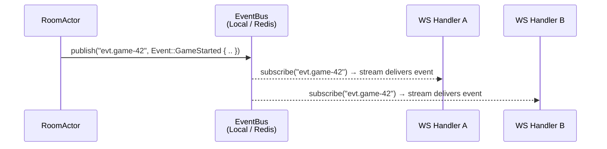
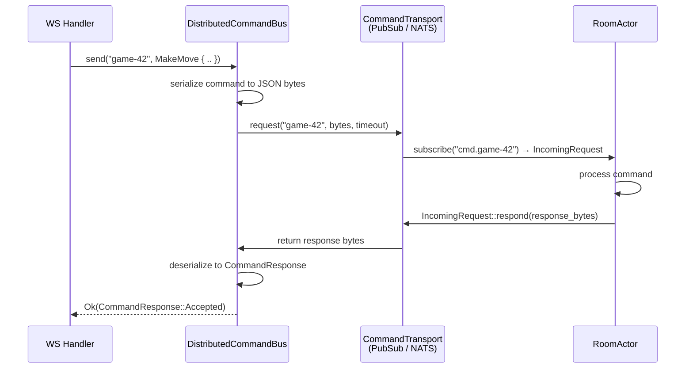

#  System Architecture

This document describes important actors, design decisions, and key components of the system.

## Flexibility

The server is designed to support a variety of deployment options.
From a single instance that stores all data in-memory, up to a fleet of servers that write and read data in persistent backends (a SQL database, Redis, Cassandra, S3, you name it) depending on the use-case.

### Supported Backends

| Component         | In-Memory | Redis | NATS | PostgreSQL | Local Filesystem | S3 | Cassandra |
|-------------------|-----------|-------|------|------------|------------------|----|-----------|
| Room storage      |    ✅     |  ✅   |  ✅  |            |                  |    |           |
| Room lease        |    ✅     |  ✅   |  ✅  |            |                  |    |           |
| Event bus         |    ✅     |  ✅   |  ✅  |            |                  |    |           |
| Command transport |           |  ✅*  |  ✅  |            |                  |    |           |

\* Redis serves as the transport via `PubSubCommandTransport` — it emulates
request-reply over Redis pub/sub with per-request inbox subjects.

## Key Terminology

<!-- TODO: This should be re-written / re-organized in sections -->

- A `Room` (defined in [`src/room.rs`](./src/room/mod.rs)) is a place where two players come together and play a game of chess.
  It provides a "root" for storing data like what players are involved, which of the three phases a room is in, or what the board currently looks like.
  This simplifies the storage implementations, as most of the data for a room can be serialized to e.g. JSON and stored as a single `room-id.json` on disk.
  The `Room.id` field also provides a central identifier that is referenced when it would be impractical to store all room data together, e.g. when storing the chat messages.
- The two `User`s (also called "player") are the only ones allowed to move pieces in the game.
  They get random identifiers assigned to them and store a secret string on the client side, that can be used to proof identity after a player disconnects.
- A `Room` has three [`Phase`s](./src/room.rs):
  1. The **Lobby**, where two players meet by sharing links 
  2. The **Game**, where they play chess as usual
  3. The **Post Game**, where the players can decide to re-match in a new room

## Distributed System Components

Some parts of the system look _way_ to complicated for a single-server deployment.
And they most definitely are, but they also enable us to run multiple servers that act together as a whole system.

### Actors

A `Room` is always managed by a single **actor** ([`src/actor/`](./src/actor/), see [`registry.rs`](./src/actor/registry.rs)), which is the only entity that reads, writes, and optionally persists its data to a storage backend.
This might be a bit over-kill, but I wanted to try this out and it frees us from having to worry about locks, database transactions, or other synchronization primitives.

### Room Leases

A lease is a distributed mutex ([`src/actor/lease/`](./src/actor/lease/mod.rs)). 
It ensures at most one server instance spawns one actor that manages a room.
The actor holding it periodically renews it acting as a heartbeat.
If a server crashes, all of its lease expires and another healthy server can acquire it.

### Event And Command Bus

The system uses two separate communication patterns: **event broadcast** and
**command request-reply**. Both are abstracted behind traits so backends can be
swapped without changing the rest of the system.

---

#### `EventBus` — pub/sub broadcast

The [`EventBus`](./src/communication/bus/mod.rs) trait is a generic pub/sub
bus. Multiple subscribers can listen on the same subject; each published
message is delivered to **all** current subscribers.

```rust
trait EventBus {
    type Item;

    fn publish(&self, subject: &str, item: Self::Item) -> ...;
    fn subscribe(&self, subject: &str) -> Result<Stream<Item = Self::Item>>;
    fn remove(&self, subject: &str);
}
```



**Concrete subjects used with `Item = Event`:**

| Subject | Direction | Description |
|---|---|---|
| `evt.{room_id}` | Room → WS handlers | Events broadcast by the room actor |

The actor publishes events through `PublisherScope::publish(event)` which
writes to `evt.{room_id}`. WebSocket handlers subscribe to the same subject
to forward events to connected clients.

**Supported backends:**

- **Local** — in-memory `tokio::sync::broadcast` channels, one per subject
- **Redis** — Redis pub/sub channels named after the subject string
- **NATS** — NATS core pub/sub subjects, identical serialization pattern

---

#### `CommandTransport` — request-reply

The [`CommandTransport`](./src/communication/transport/mod.rs) trait is a
point-to-point request-reply transport for **commands**. Unlike the event
bus, each command expects exactly one response.

```rust
trait CommandTransport {
    fn request(&self, room: &RoomId, payload: Vec<u8>, timeout: Duration)
        -> Result<Vec<u8>>;

    fn subscribe(&self, room: &RoomId)
        -> Result<Stream<Item = IncomingRequest>>;
}
```



**Concrete subjects / addressing:**

| Location | Backend | Subject / address |
|---|---|---|
| Command dispatch | PubSub | `cmd.{room_id}` — JSON envelope `{ reply_to, payload }` |
| Reply (PubSub only) | PubSub | `_inbox.{n}` — per-request inbox subject |
| Command dispatch | NATS | `cmd.{room_id}` — NATS subject |
| Reply (NATS) | NATS | Managed by NATS internally (`_INBOX.…`) |

**Supported backends:**

- **PubSub** — request-reply emulated over a generic `EventBus<Item = Vec<u8>>`:
  a unique inbox subject `_inbox.{n}` is created per request, the reply-to
  address is embedded in a JSON `TransportEnvelope`
- **NATS** — native request-reply via `Client::request()`; NATS manages inbox
  subjects at the protocol level, no application envelope needed
